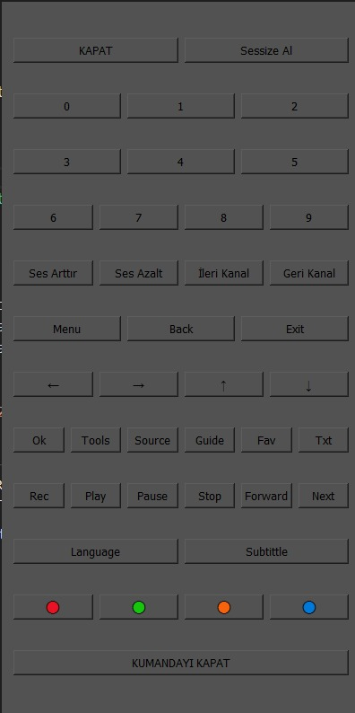

### Features
- It is basic remote controller for grundig smart tv coded with python
- It based on 39 diffrent commands
- Includes 2 python file and it is opensource basic python project
- !!! these codes are only working for Grundig smart Tv
# How it's look

-Basic interface design 

- Code integrated the main as file named window

